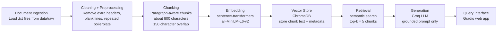

# Project 1 Planning: The Unofficial Guide

## Domain

My domain is an unofficial guide for ASU Computer Science courses and professor/course experiences. The system will answer student questions about course difficulty, workload, exams, projects, professor helpfulness, preparation advice, and whether certain classes should be taken together.

This knowledge is valuable because official ASU course pages explain topics and prerequisites, but they do not show what students actually experience in the class. Student advice is scattered across Reddit threads, Rate My Professors-style reviews, Discord notes, and informal forums, so a RAG system can make the information easier to search and cite.

[Rewrite this section in your own words. Add 1 sentence explaining why this domain matters to you as a CS student.]

## Documents

I will collect at least 10 student-generated documents and save them as plain text files in `data/raw/`. Each file includes the source URL at the top, followed by copied or summarized student-generated comments from public student discussions.

Planned source files:

1. `data/raw/cse110_reviews.txt`

   * Source: r/ASU discussion about CSE 110
   * URL: https://www.reddit.com/r/ASU/comments/1cly644/cse_110/
   * Main topic: whether CSE 110 depends heavily on professor choice and how students describe the intro programming course.

2. `data/raw/cse205_reviews.txt`

   * Source: r/ASU discussion comparing CSE 205 professors
   * URL: https://www.reddit.com/r/ASU/comments/qdk2wz/cse_205_feng_vs_navabi/
   * Main topic: professor choice, exam style, TA support, and course manageability.

3. `data/raw/cse230_reviews.txt`

   * Source: r/ASU discussions about CSE 230 difficulty and preparation
   * URLs:

     * https://www.reddit.com/r/ASU/comments/1apat4w/cse_230_makes_me_regret_coming_to_asu/
     * https://www.reddit.com/r/ASU/comments/gzj304/any_advice_on_prepping_for_cse_230/
   * Main topic: MIPS, assembly, number conversions, course organization, and student frustration.

4. `data/raw/cse240_reviews.txt`

   * Source: r/ASU discussions about CSE 240 and CS professors
   * URLs:

     * https://www.reddit.com/r/ASU/comments/1ixpih7/review_of_different_cs_professors/
     * https://www.reddit.com/r/ASU/comments/17i0g9l/cse_240/
   * Main topic: professor helpfulness, workload, assignments, and exam difficulty.

5. `data/raw/cse310_reviews.txt`

   * Source: r/ASU discussions about CSE 310
   * URLs:

     * https://www.reddit.com/r/ASU/comments/e9q52j/anyone_nervous_about_taking_xue_for_cse_310/
     * https://www.reddit.com/r/ASU/comments/gj3tp9/cse_310_in_the_fall/
     * https://www.reddit.com/r/ASU/comments/18gk8ok/preparation_for_cse310/
   * Main topic: algorithms, C++, runtime analysis, projects, and preparation strategy.

6. `data/raw/cse340_reviews.txt`

   * Source: r/ASU discussion about preparing for CSE 340 and CSE 355
   * URL: https://www.reddit.com/r/ASU/comments/w89geu/how_to_prepare_for_cse_355_and_cse_340_what/
   * Main topic: project difficulty, starting early, asking TAs for help, and time management.

7. `data/raw/cse355_reviews.txt`

   * Source: r/ASU discussion about preparing for CSE 355
   * URL: https://www.reddit.com/r/ASU/comments/13yvlki/how_do_i_prepare_for_cse_355/
   * Main topic: automata, theory, proofs, office hours, textbooks, and outside resources.

8. `data/raw/cse360_reviews.txt`

   * Source: r/ASU discussions about CSE 360 workload
   * URLs:

     * https://www.reddit.com/r/ASU/comments/13c4dfj/cse_360_or_cse_365_with_cse_310_and_cse_230/
     * https://www.reddit.com/r/ASU/comments/1ctun95/can_anyone_give_me_an_honest_review_of_cse_360/
   * Main topic: group projects, quizzes, professor differences, and workload.

9. `data/raw/cse365_reviews.txt`

   * Source: r/ASU discussions about CSE 365
   * URLs:

     * https://www.reddit.com/r/ASU/comments/gdsrbw/cse_365_doable_during_summer/
     * https://www.reddit.com/r/ASU/comments/1i8h9ss/what_is_the_hardest_class_for_cs_majors_why_do/
   * Main topic: coding workload, cybersecurity class difficulty, summer scheduling, and professor choice.

10. `data/raw/cse412_reviews.txt`

    * Source: r/ASU discussions about CSE 412
    * URLs:

      * https://www.reddit.com/r/ASU/comments/asyu8n/cse_412_database_management_with_dr_nakamura/
      * https://www.reddit.com/r/ASU/comments/spanaw/cse_412_434_445/
    * Main topic: database management, SQL, difficulty, usefulness, and comparison to other upper-division electives.

Before implementation, I will verify that each file has a source URL, source title, and student-generated text. I will avoid using private personal information and will keep the documents focused on course and professor experiences.

[Verify the URLs open correctly. If any URL is broken, replace it with another public student discussion.]

## Architecture

## Chunking Strategy

My documents are mostly short student comments, Reddit-style posts, and course advice notes. Because the important information usually appears in paragraphs or short groups of sentences, I will use paragraph-aware chunking instead of splitting every fixed number of characters.

My target chunk size will be about 800 characters with about 150 characters of overlap. This should keep related information together, such as course name, professor name, workload, exam style, and preparation advice. The overlap helps if a useful detail appears near the end of one chunk and continues into the next chunk.

If a paragraph is short, I will combine it with nearby paragraphs from the same document until it becomes a meaningful chunk. If a paragraph is too long, I will split it by sentence while preserving overlap. I will remove empty chunks and very short fragments.

A good chunk should be understandable on its own. For example, a good chunk might include the course name, the student opinion, and the reason behind the opinion. A bad chunk would be only a sentence fragment, leftover formatting, or several unrelated courses mixed together.

I will inspect at least 5 sample chunks before creating embeddings. If the chunks are too small, retrieval may return vague fragments without enough context. If the chunks are too large, retrieval may return broad chunks that include too many unrelated opinions.

[After you run your pipeline, update this section if you change the chunk size or overlap.]

## Retrieval Approach

I will use `sentence-transformers` with the `all-MiniLM-L6-v2` embedding model. This model runs locally, does not require paid API access, and is suitable for a small course project.

I will store the chunk embeddings in ChromaDB. Each stored chunk will include metadata such as the source file name, course number, chunk index, and source URL when available. This metadata is necessary because every final answer needs source attribution.

For each user question, I will retrieve the top 5 most relevant chunks. I chose top-k = 5 because one or two chunks may miss important context, while too many chunks could add unrelated information and confuse the answer generation step.

Semantic search is useful for this project because students may ask questions using different wording than the source documents. For example, a user may ask “Which class is project-heavy?” even if the source says “start projects early” or “the group project takes a long time.”

If this system were used in production, I would compare embedding models based on retrieval accuracy, cost, speed, context length, privacy, and whether the model handles informal student language well. A larger API-based embedding model might improve accuracy, but a local model is cheaper and easier to run.

## Evaluation Plan

I will evaluate the system using 5 test questions. For each question, I will record the expected answer, the system response, the retrieved chunks, and whether the result is accurate, partially accurate, or inaccurate.

1. Question: What do students say is difficult about CSE 310?

   * Expected answer: The answer should mention that CSE 310 is difficult because of algorithms topics, runtime analysis, projects, C++, and the jump in difficulty compared with earlier classes.

2. Question: How should students prepare for CSE 340?

   * Expected answer: The answer should mention starting projects early, asking TAs for help, and managing time carefully.

3. Question: Why do students say CSE 355 is challenging?

   * Expected answer: The answer should mention theory-style content such as automata, Turing machines, state diagrams, logic, proofs, and the need for outside resources or office hours.

4. Question: What do students say about the workload in CSE 360?

   * Expected answer: The answer should mention the group project, quizzes, writing, multiple phases, professor differences, and that the course may be manageable but time-consuming.

5. Question: Which classes should a student avoid taking together with too many other hard classes?

   * Expected answer: The answer should point to courses described as time-consuming or difficult, such as CSE 340, CSE 355, CSE 365, or CSE 310, depending on which retrieved documents provide the strongest evidence.

I will also test at least one out-of-scope question, such as “Which dorm has the best food?” Since my documents are about CS courses and professors, the system should say that it does not have enough information instead of making up an answer.

[After building the system, replace these expected answers with the exact evidence from your retrieved source chunks.]

## Anticipated Challenges

One challenge is noisy text. Reddit posts and student comments may include jokes, usernames, side conversations, deleted comments, repeated formatting, or unrelated opinions. I will clean the documents before chunking and remove content that does not help answer course-related questions.

Another challenge is preserving source attribution. The project requires answers to cite their sources, so I need to keep source metadata from ingestion through retrieval and generation. If metadata is lost, the final answer may be correct but not properly grounded.

A third challenge is retrieval quality. Some course numbers are short and similar, such as CSE 340, CSE 355, and CSE 360. If the chunks do not include the course number or if the query is broad, the retriever may return chunks from the wrong course. I will test retrieval before generation and inspect the returned chunks.

A fourth challenge is conflicting opinions. Student reviews are subjective, so one student may describe a class as easy while another describes it as very hard. The system should summarize the range of opinions instead of pretending there is only one correct view.

## AI Tool Plan

I will use AI tools to help implement the system, but I will not use them to create fake data, fake citations, or fake evaluation results.

First, I will use ChatGPT or Copilot to help implement the document ingestion and cleaning script. I will give the AI my Documents section and Chunking Strategy section and ask it to create Python code that loads `.txt` files from `data/raw/`, cleans the text, and outputs chunks with metadata.

Second, I will use AI assistance to help implement the embedding and vector store code. I will give the AI my Retrieval Approach section and ask for code that embeds chunks with `all-MiniLM-L6-v2`, stores them in ChromaDB, and retrieves the top 5 chunks for a query.

Third, I will use AI assistance to help design the grounded generation prompt. I will require the generated answer to use only retrieved context and to say “I do not have enough information” when the retrieved documents do not support an answer.

Fourth, I will use AI assistance to help build a simple Gradio interface. The interface will have a text input for the question and output areas for the answer and retrieved sources.

I will review and modify all AI-generated code to match my actual file structure and project requirements. I will also document in the README what I asked the AI to do, what it produced, and what I changed.

**Milestone 3 — Ingestion and chunking:**

**Milestone 4 — Embedding and retrieval:**

**Milestone 5 — Generation and interface:**
